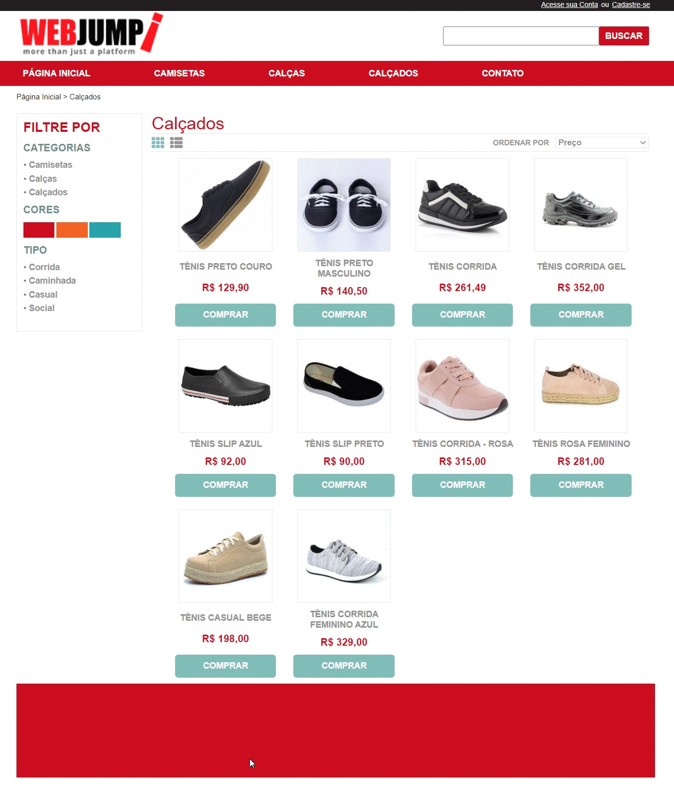

{width="200px"}

## :dart: Desafio

Tornar o layout disponibizado em uma página funcional!

## :rocket: Tecnologias

As seguintes ferramentas foram usadas na construção do projeto:

- [React](https://pt-br.reactjs.org/)
- [NextJS](https://nextjs.org/)
- [Styled-components](https://expo.io/)

## :white_check_mark: Pré requisitos

Antes de começar :checkered_flag:, você precisa ter o [Git](https://git-scm.com) e o [Node](https://nodejs.org/en/) instalados em sua maquina.

## :checkered_flag: Começando

```bash
# Clone este repositório
$ git clone https://eltonfx@bitbucket.org/eltonfx/assessment-frontend.git

# Entre na pasta
$ cd assessment-frontend

# Instale as dependências
$ yarn

# Para iniciar o projeto
$ yarn dev

# O app vai inicializar em <http://localhost:3000>
```
