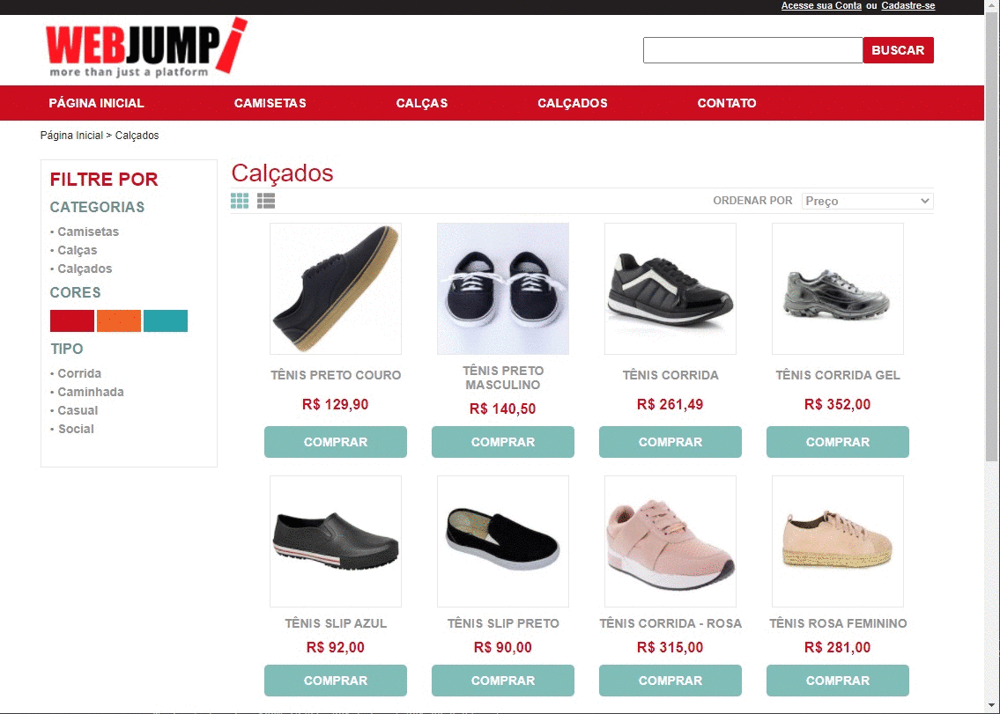

<div align="center" id="top"> 
  

&#xa0;

<a href="https://webjumpchallenge.vercel.app/calcados">Demo</a>

</div>

<!-- <h1 align="center">WebJump</h1> -->

<!-- <p align="center">
  

  

  

   -->

  <!--  -->

  <!--  -->

  <!--  -->
<!-- </p> -->

<!-- Status -->

<!-- <h4 align="center">
	<!-- 🚧  [PROJECT_NAME] 🚀 Em construção...  🚧 -->
<!-- </h4> -->

<!-- <hr> -->

<!-- <p align="center">
  <a href="#dart-sobre">Sobre</a> &#xa0; | &#xa0;
  <a href="#sparkles-funcionalidades">Funcionalidades</a> &#xa0; | &#xa0;
  <a href="#rocket-tecnologias">Tecnologias</a> &#xa0; | &#xa0;
  <a href="#white_check_mark-pré-requesitos">Pré requisitos</a> &#xa0; | &#xa0;
  <a href="#checkered_flag-começando">Começando</a> &#xa0; | &#xa0;
  <a href="#memo-licença">Licença</a> &#xa0; | &#xa0;
  <a href="https://github.com/eltton" target="_blank">Autor</a>
</p>

<br> -->

## :dart: Sobre

Sobre o seu projeto

## :sparkles: Funcionalidades

:heavy_check_mark: Desafio Tecnico;\

## :rocket: Tecnologias

As seguintes ferramentas foram usadas na construção do projeto:

- [React](https://pt-br.reactjs.org/)
- [TypeScript](https://www.typescriptlang.org/)
- [Styled-components](https://expo.io/)
- [React- toastify](https://nodejs.org/en/)
- [Json Server ](https://reactnative.dev/)

## :white_check_mark: Pré requisitos

Antes de começar :checkered_flag:, você precisa ter o [Git](https://git-scm.com) e o [Node](https://nodejs.org/en/) instalados em sua maquina.

## :checkered_flag: Começando

```bash
# Clone este repositório
$ git clone https://github.com/eltton/[PROJECT_NAME]

# Entre na pasta
$ cd [PROJECT_NAME]

# Instale as dependências
$ yarn

# Para iniciar o projeto
# $ yarn start
$ yarn dev

# O app vai inicializar em <http://localhost:3000>
```

## :memo: Licença

Este projeto está sob licença MIT. Veja o arquivo [LICENSE](LICENSE.md) para mais detalhes.

Feito com :heart: por <a href="https://github.com/eltton" target="_blank">eltton</a>

&#xa0;

<a href="#top">Voltar para o topo</a>
